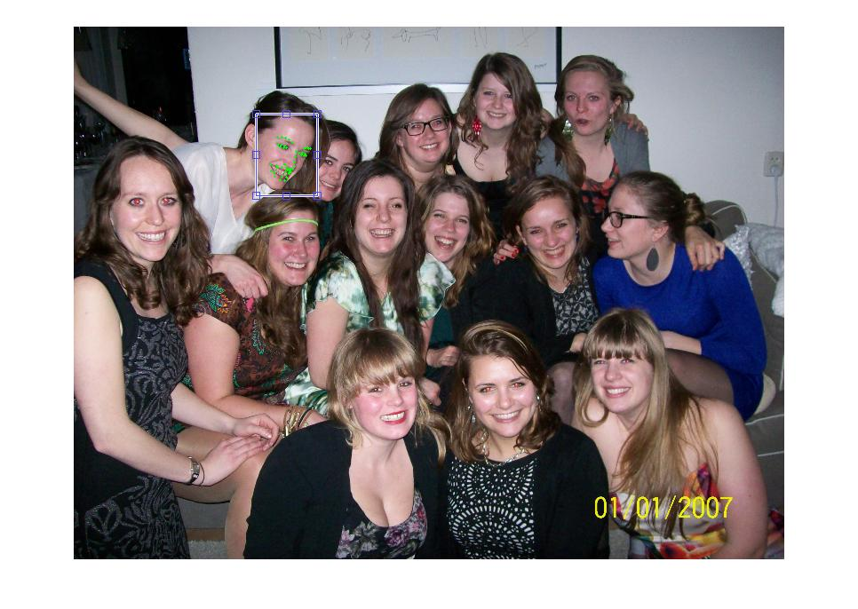
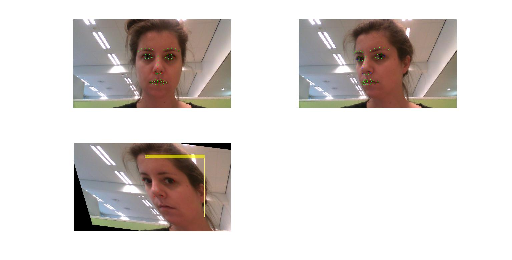

PhotoVision
===========

**TODO**

- Determine whether within class coveriance for mahalonobis can be used
- find discriminant identity parameters
- Determine ID subspace to project parameters onto
 

An application that searches through a folder recursively for images of a certain person described using multiple images. The application returns all images found, seperating them into good looking images where the person is smiling and the eyes are open, group pictures and other photos. 

##The problem
The challenge of finding images of a certain person within a database of photos can be split up into multiple parts iterated over all images in the database:

- Process query images
- Detecting faces
- Perform face verification using Active Appearance Models assuming we already have a shape and texture model
    - Fit the model onto any found faces
    - Allign the features 
    - Represent the face's appearance
- Classify the similarity and verify
- Verify whether the person is smiling
- Group all similar photo's 

##The solution

- Describe face images 
    - Invariability
    - Model
- Matching models with images

To be able to do this, the model of object appearance should be as complete as possible in order to make a justified approximation of the object itself. When this is the case, the variability can be understood. Robust performance can be achieved by using a model to constrain solutions are valid faces. 

In order to interpret new images, an efficient method for finding the best match between image and model is necessary. 

Because the optimization problem is the same for every face, generality can be solved offline by finding similarities offline, rapid convergence can be achieved through search space. 

By integrating evidene of a large database of faces, recognition can be improved. 

### Active appearance models

The active appearance models are generated by combing a model of shape variation with a model of the appearance variations in a shape-normalized frame. For this, a training set of labelled images is necessary where landmarks mark key positions on each example face. The points are alligned in a common co-ordinate frame and are then represented by a vector x uppon which the principal component analysis(PCA) can be done generating a statistical model of the shape variation. 

x = xmean + Psbs

A statistical model of the gray-level appearance can be generated by warping the example image so its control points match the mean shape. By extracting gray-level informaton fron the region covered by the mean shape and normalizing it the effect of global lighting variation is minimized. PCA can then be applied to obtain a linear model.

For each example we gain a set of shape parameters and gray-level parameters. We apply PCA to a concatenated vector of the example faces by adding a diagonal matrix of weights for each shape parameters to allow differentiation in units.

By using the appearance model a set of parameters is gained varying in identity, expression, pose and lighting. This way the identity can be estimated independently from other parameters. In the active appearance models mage difference patterns correspond to changes in each model parameter and are learnt and used to modify a model estimate. 

### AAM search 

An efficient algorithm for adjusting model parameters to match the images has to be set. By first finding the largest differences in the face, we already know which parameters have to be adjusted to find the best match called learnt regression. This done in multi-resolution to provide a wider location range. 

### Face recognition - matching algorithm

Given a new example of the face and extracted model parameters, the indiidual should be identified invariantly to confounding factors such as lghting, pose and expression. This can be done using the Mahalonobis distance measure. This enhances the effect of inter-class variation(identity) and surpresses the effect of within class variation (pose, lighting, expression). However this within class covariance matrices are not alway available

Sources of variation can also be isolated assuming the within-class variation is very similar for each individual and the pooled covariance matrix provides a good overall estimate of this veriation. Knowing this, the inter-class variability can be linearly seperated from the intra-class variability using a Linear Discriminant Analysis (LDA).

The identity of a face is given by a vector is discriminant parameters d, ideally only encoding information important to identity. The transformation between appearance parameters c and dscriminant parameters is given by multiplying c with a matrix of orthogonal vectors describing the prinicpal types of inter-class variation. The euclidean distance between images projected onto this space is a measure of similarity of ID between the images. 

Source of variation:
- pose changes
- lighting changes
- changes due to difference in individual appearance
- changes due to expression or other face movement

### Expression recognition

##Implementation

Using the IntraFace library, a model can be fitted to any detected faces containing 43 feature points . From these features points the discriminant features can be extracted. However to compare them amongst one another for verification, they have to be warped to a general perpective. To do this, a mean face of preferred face has to be choosen. As warping all points would distort the identification of the persons, certain control points have to be chosen that are independent from the identification features and thus can be used to warp onto the choosen mean face. 

###Used libraries and data
Intraface provides the matlab code for face recognition using OpenCV. However it only recognizes the frontalfaces and does not recognize any profile faces. Intraface initialized the models using certain set parameters: the minimum face score for recognized faces, its minimum neighbors, the minimum face-image ratio an a flag whether or not to compute the pose.

###Own implementations

When running the intraface detect_image functionality, not all faces are actually recognized (10/14) using the 'auto' opencv functionality. However when using the 'interactive' mode that allows for manually annotating all images, it will recognize all but 1 face (13/14). This indicates that the face detection isn't working properly and needs adjusting.

When looking for solutions, I discovered that the matlab and the opencv implementation for finding faces isn't rotation invariant which was the reason no faces were discovered. 

When fitting the model using the interactive mode, the faces were indeed recognized. When rotating the image, some faces were also found. For this reason I played around with the matlab face vision cascade object detectors. Using a combination of the default frontalface variant, the profileface and the lbp variant, we can detect (not fit) all but 1 face. As this face is particularly small and occluded and does not necessarily meet the needs for the final application, i did not put any more effort into detecting this face.  Also, the face detecting algorithm was able to detect the profile face with glasses, but the model fitter was unable to fit to the face. 

### Normalizing the faces
When the feature model is fit onto the face, its features need to be normalized in order to compare them amongst one another. This can be done using a mean shape, or using a image that displays the preferred shape model. Because there is no databade available for the model used by Intraface, made an image that looks straight ahead and thus will function as a base line shape upon which  the test image will be warped. 

When warping the images, control points must be selected that will control the warp. These points should be identification invariable as the warp should not influence the identification features. The identification features that is used is the ratio of the length of the nose with the distance in between the eyes. To accomodate a correct warp it would have been preferable to have features surrounding the contour of the face as they hardly influence any identification features. However, as I didn't have this luxury and thus also couldn't perform a triangle based interpolation or piecewise affine warp, I decided to use the outside points of the nose, the outside points of the eye and the tip of the nose. Using the fitgeotrans function of Matlab I warped the control points using affine interpolation. The next problem occured, the detcted faces did not include the entire face as the face was now rotated. For this reason I had to combine the original detected face with the newly detected face so the model could fit the feature points properly. This provided the following results:

When using these images, the frontal mean shape ratio can be determined of the faces that is searched which is 1.0730 and the ratio of the query face is 1.1034. 

imara: 1.0730 - 1.1034
laurens: 1.0695

 **todo: argument why using these discriminant features**

##Shortcomings

- no feature points around jaw line
- no available appearance model

##Experiments

Experiments can be done by altering the images by removing the d, so only identity remains. We can remove even more, which would only leave lighting changes etc. 

##Results